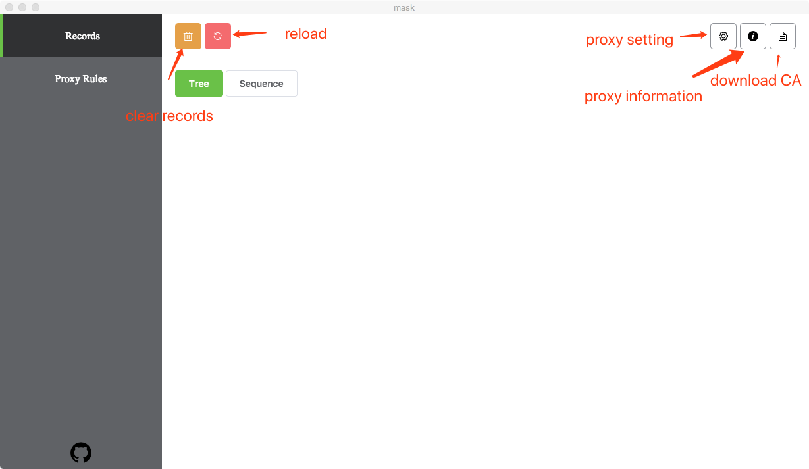

Mask
====
[中文](https://github.com/iammvp/mask/blob/master/README.md)
[English](https://github.com/iammvp/mask/blob/master/README.md)

Mask is an open source mitm proxy tool. It is developed by electron and vue. It supports both HTTP and HTTPS proxy. The purpose of Mask is make a simple proxy tool for mac front-end engineer.

## Download
[Download](https://github.com/iammvp/mask/releases/latest)

## Install CA

HTTPS becomes more and more popular, you must install Mask CA if you want handle HTTPS requests.

### Install CA on MAC

1. click *Downlaod* button on download CA popup, or setting you mac local proxy then visit [getca.mask](http://getca.mask)
2. double click downloaded file:maskCA.crt
3. double click MASK CA in popup window
4. set to *Always Trust* on Trust

### Install CA on iphone

1. set proxy on your phone
2. scan qrcode on download CA popup(open on *Safari* if the url not jump automaticly), or open 'http://getca.mask' in Safari in your phone
3. select allow, then select install
4. on your phone go to Settings - General - About - Certificate Trust Settings, enable MASK CA

### Install CA on android

1. set proxy on your phone
2. scan qrcode on download CA popup(open on *default browser* if the url not jump automaticly), or open 'http://getca.mask' in default browser in your phone
3. click download "SSL certificate"（some phones may install it automaticly, if so skill this step)
4. on you phone go to Settings -> Security -> Install from SD card, and find you CA file to install (this step may not excatly same due to different phones,but you can find the right way in you system with similar menu path)

## Interface

1. reload button will clear all records and reload app, it is a good way to release ram
2. you can set proxy port, data size limitation on proxy setting popup
3. Mask will set your mac proxy if you enable *Local proxy*
4. you can find useful information on proxy information popup

## Forward rule

- both match and replace support fuzzing matching, you just need add * at the end of you rule, such as:
  - match:`http://example1.mask/*`, replace: `http://example2.mask`, will make both `http://example1.mask/page1.html` and `http://example1.mask/page2.html` forward to `http://example2.mask`
  - match:`http://example1.mask/*`, replace: `http://example2.mask/*`, will make `http://example1.mask/page1.html` forward to `http://example2.mask/page1.html`; but `http://example1.mask/page2.html` will forward to `http://example2.mask/page2.html`
- if multiple rules match to a single request, only the first one will effect

Q & A
===

Q: Why mask requst for administrator password？

A: administrator password is required for setting local proxy, Mask only ask for once

Q: can not proxy for local CSS, JS file.

A: browser cache will prevent assert file requsts, you can use cmd+shift+r to hard refresh on Chrome.

Q: some requests are not send.

A: same reason as previous.

