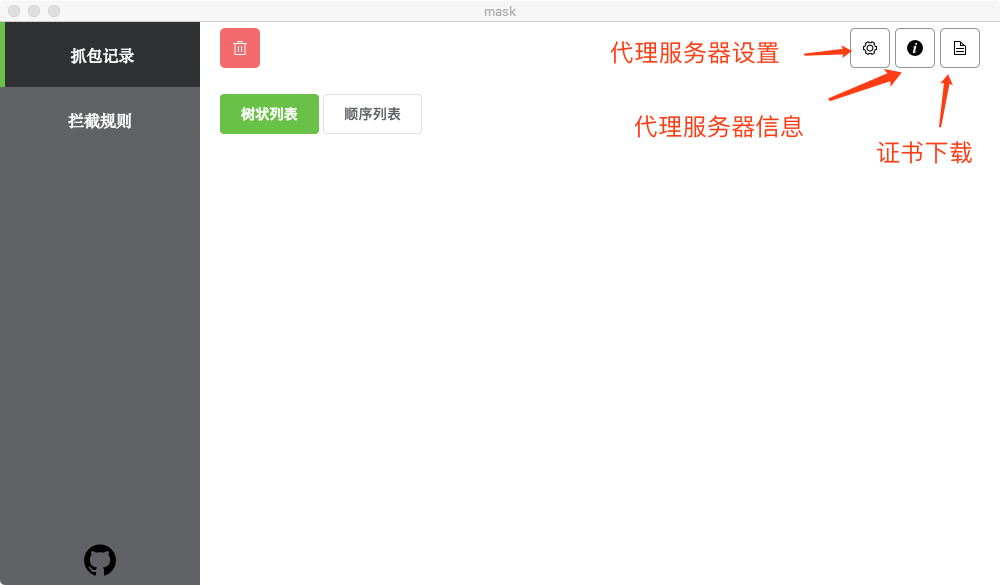

Mask
====
Mask 是一个开源的跨平台的抓包工具。它是通过electron+vue开发，开发思想参考了anyproxy等工具,力求提供给前端们(特别是mac用户)一个简单易用抓包工具。

使用
===

## 安装证书

目前互联网环境 HTTPS 越来越流行，普通的 HTTP 抓包已经渐渐无法满足要求。Mask 默认就会对 HTTPS 代理，代理 HTTPS 必须安装 Mask 伪造的安全证书。

### MAC 安装证书

1. 在 Mask 证书弹窗点击*下载证书*按钮，或者在电脑开启代理的情况下访问 [getca.mask](http://getca.mask)
2. 双击下载完成的证书安装。
3. 在弹窗中双击 MASK 证书。
4. 在信任一栏选择*始终信任*

### Win 安装证书

1. 在 Mask 证书弹窗点击*下载证书*按钮，或者在电脑开启代理的情况下访问 [getca.mask](http://getca.mask)
2. 双击下载完成的证书安装。
3. 点击“安装证书”。
4. 选择“当前用户”，下一步。
5. 选择将“将所有的证书放入下列存储”。
6. 点击浏览，选择“受信任的根证书颁发机构”，下一步。

### iphone 安装证书

1. 设置代理
2. 在 Mask 证书弹窗扫描二维码(若未自动跳转,请选择在*Safari中打开*)或者在 Safari 打开 'http://getca.mask'
3. 选择允许，然后选择安装
4. 在 系统设置 - 通用 - 关于本机 - 证书信任设置 里打开对 Mask 证书的信任

### android 安装证书

1. 设置代理
2. 在 Mask 证书弹窗扫描二维码(若未自动跳转,请选择在*Safari中打开*)或者在 系统自带浏览器里 打开 'http://getca.mask'
3. 点击下载“SSL证书”（有的手机系统会自动安装证书，可跳过后续步骤）
4. 在 系统设置 - 更多 or 高级 - 系统安全 - 从存储设备安装 里选择下载的证书文件

## 界面

## 拦截规则

- 匹配和替换都支持模糊匹配，只需要在最后添加*，例如：
  - 匹配：`http://example1.mask/*`，替换：`http://example2.mask`，会让 `http://example1.mask/page1.html` 和 `http://example1.mask/page2.html` 都替换成 `http://example2.mask`
  - 匹配：`http://example1.mask/*`，替换：`http://example2.mask/*`，会让 `http://example1.mask/page1.html` 替换成 `http://example2.mask/page1.html`；而 `http://example1.mask/page2.html` 会替换成 `http://example2.mask/page2.html`
- 如果多条规则匹配到相同的请求地址，则只有第一条会起效果

问题
===

Q：本地替换 CSS，JS 无效？

A：浏览器缓存会导致一些静态文件不发送请求，清除浏览器缓存（chrome 下 cmd+shift+r 刷新，或者 Network 下 选择 Disable cache）

Q：有些请求不发送？

A：同上面，浏览器缓存原因
